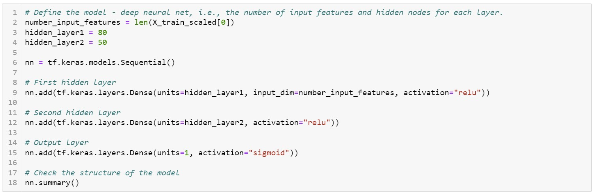
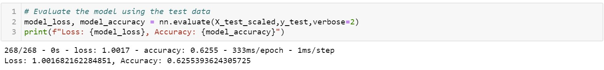
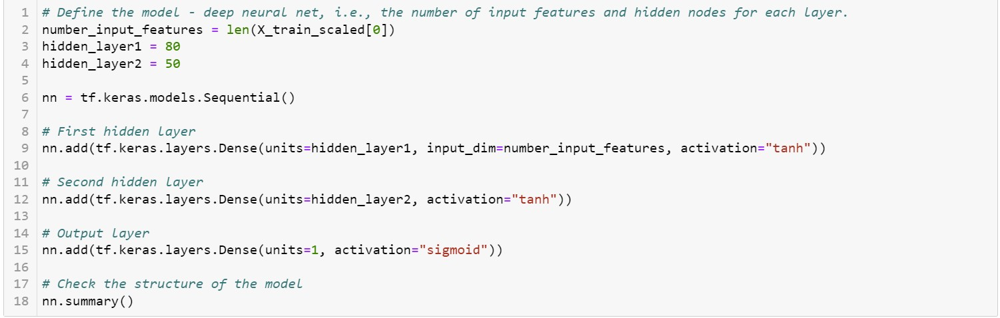
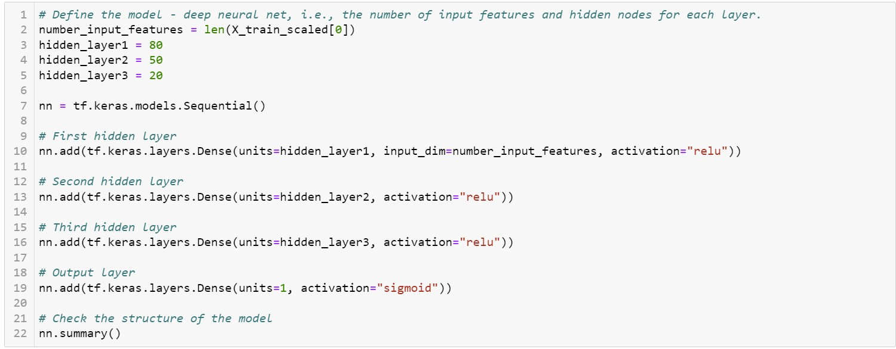
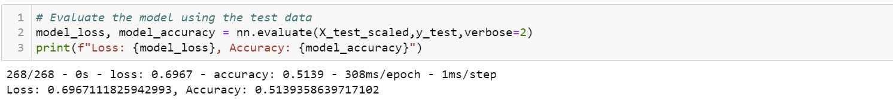
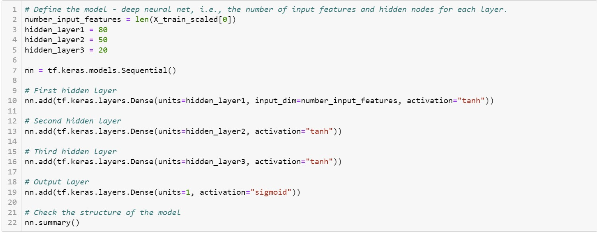
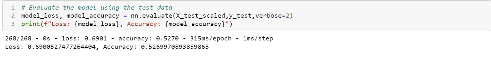

# ChallengeModule_20-Neural-Networks-and-Deep-Learning-Models

ChallengeModule_20-Neural-Networks-and-Deep-Learning-Models

## Overview of the Analysis

Use the features in the provided dataset to help Beks create a binary classifier that is capable of predicting whether applicants will be successful if funded by Alphabet Soup. (From Module 20 Challenge Page)

## **Results**

### Data Preprocessing

* The target variable for the model was the "IS_SUCCESSFUL" column."
* The features of the model were the following columns: "APPLICATION_TYPE", "AFFILIATION", "CLASSIFICATION", "USE_CASE", "ORGANIZATION", "STATUS", "INCOME_AMT", "SPECIAL_CONSIDERATIONS", AND "ASK_AMT"
* The "EIN" and "NAME" and name columns were neither targets nor features.

### Compiling, Training, and Evaluating the Model

The screen shots below show the neurons, layers, activation and accuracy for the original model, and attempts one, two, and three.  None of the changes increased accuracy over the original attempt nor did they preform over the 75% accuracy threshold set in the Challenge.  All 3 attempts were ran on 50 Epochs instead of the 100 on the original model.  Attempt 1 changed activation to "tanh". Attempt 2 changed the activation back to "relu" but added a hidden layer.  Attempt 3 went back to "tanh" activation but kept the hidden layer.

* Original Attempt 
* Attempt 1
  

  
* Attempt  2
* Attempt 3

  

  

## Summary

Given the failure of the three attempts to reach 75% accuracy an in this case inprove on the original attempt, it is suggested that the removal/addition of columns and variations in binning are considered in future optimazation.  All 3 attempts preformed in the low 50% range, so it would also be suggested that future attempts at optimazation start with the original model.  Once the accuracy is improved on the original by variations in binning and columns then further exploration intodifferent activation methods and neurons could be further explored.
